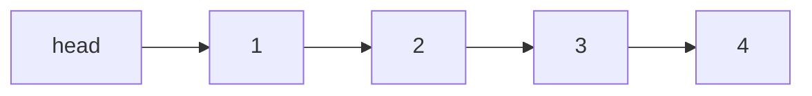
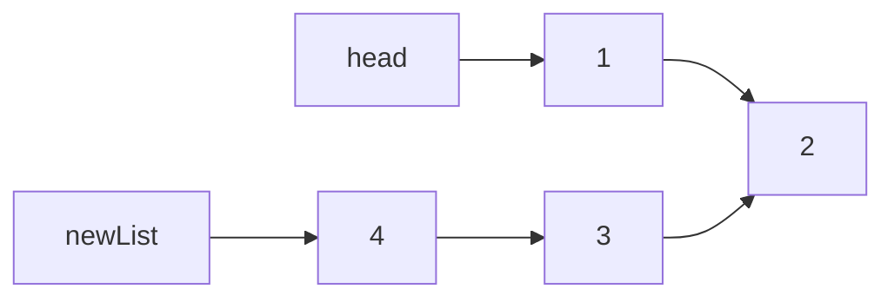

## 递归

**要领**：

1. 定义清楚每个递归函数应该要做的事，并相信它能够做好
2. 寻找结束条件
3. 寻找等价关系

**例1**：二叉树根节点root和一个目标值sum，返回数中和等于目标值的路径条数，编写pathSum函数

**分析：**首先肯定要遍历二叉树，遍历二叉树的框架放在pathSum中。对于每个节点，他们应该干什么？他们应该看看，自己和脚底下的小弟们包含多少条符合条件的路径。明确了这两个函数，就可以开始写了

```
int pathSum(TreeNode* root, int sum) {
	if(root == NULL) return 0;
	//自己为开头的路径数
	int r = count(root, sum);
	//左边路径总数(相信它能算出来)
	int leftPathSum = pathSum(root->left, sum);
	//右边路径总数(相信它能算出来)
	int rightPathSum = pathSum(root->right, sum);
	return r + leftPathSum + rightPathSum;
}

int count(TreeNode* root, int sum) {
	if(root == NULL) return 0;
	//我自己能不能独当一面，作为一条单独的路径
	int me = (root->val == sum) ? 1 : 0;
	//左边的老弟，你那边能凑几个sum - root->val
	int left = count(root->left, sum - root->val);
	//右边的老弟，你那边能凑几个sum - root->val
	int right = count(root->right, sum - root->val);
	return me + left + right;
}
```

[LeetCode递归专题练习](https://leetcode.com/explore/learn/card/recursion-i/)


**例2：**归并排序，典型的分治算法。分治是一种典型的递归结构，可分为三步：分解->解决->合并

1. 分解原问题为相同的子问题
2. 分解到某一个容易求解的边界后，进行递归求解
3. 将子问题的解合并成原问题的解

```
//伪代码
void merge_sort(数组) {
	if(规模很小容易处理) return;
	merge_sort(左半数组);
	merge_sort(右半数组);
	merge(左半数组，右半数组);
}
```

下面是根据《算法导论》改写的，有几个小细节：

1. 给每一半数组的最后以为添加了哨兵位，理论上是正无穷，用INT_MAX代替
2. 形参begin，end参考c++迭代器，取左闭右开区间，即数组范围是[begin, end)

```
void merge_sort(vector<int>& nums, int begin, int end) {
	if(begin >= end - 1) return;
	//取中值
	int mid = begin + (end - begin)/2;
	//左半排序
	merge_sort(nums, begin, mid);
	//右半排序
	merge_sort(nums, mid, end);
	//结果合并
	merge(nums, begin, mid, end);
}

void merge(vector<int>& nums, int begin, int mid, int end) {
	//分别存储左半数组和右半数组
	vector<int> left(nums.begin()+begin, nums.begin()+mid);
	vector<int> right(nums.begin()+mid, nums.begin()+end);
	//添加哨兵位
	left.push_back(INT_MAX);
	right.push_back(INT_MAX);
	int p = 0, q = 0;
	for(int i = begin; i < end; ++i) {
		if(left[p] < right[q]) {
			nums[i] = left[p++];
		} else {
			nums[i] = right[q++];
		}
	}
}
```

[LeeCode分治算法专项练习](https://leetcode.com/tag/divide-and-conquer/)


**例3：**反转单链表

1. 定义函数功能

```
Node reverseList(Node head){

}
```

2. 寻找结束条件

当链表只有一个节点，或者是空表，直接返回head

```
Node reverseList(Node head){
    if(head == null || head.next == null){
        return head;
    }
}
```

3. 寻找等价关系

等价条件中一定是范围不断缩小。对于链表来说，就是链表的节点个数不断变小。例如链表：



我们就缩小范围，先对2->3->4递归试试

```
Node reverseList(Node head)
{ 
   if(head == null || head.next == null)
   {
     return head; 
   } // 我们先把递归的结果保存起来，先不返回，因为我们还不清楚这样递归是对还是错。
   Node newList = reverseList(head.next); 
}
```

我们认为reverseList可以把单链表反转，所以，对2->3->4反转后的结果是这样的



接下来，只需要把节点2的next指向1，1的next指向null就可以了。所以代码就写成这样：

```
Node reverseList(Node head)
{ 
   if(head == null || head.next == null)
   {
     return head; 
   } // 我们先把递归的结果保存起来，先不返回，因为我们还不清楚这样递归是对还是错。
   Node newList = reverseList(head.next); 
   //获取节点2
   Node t1 = head->next;
   //让2的next指向1
   t1->next = head;
   //1的next指向NULL
   head->next = NULL;
   return newList;
}
```


**例4：**移除链表中指定元素

1. 定义函数功能

```
ListNode* removeElements(ListNode* head, int val) {

}
```

2. 寻找结束条件

```
ListNode* removeElements(ListNode* head, int val) {
	if(head == NULL)
		return NULL;
}
```

3. 寻找等价关系

```
ListNode* removeElements(ListNode* head, int val) {
	if(head == NULL)
		return NULL;
	
	//我们相信removeElements已经把指定的元素都删除了，dummy是处理后的链表头节点
	ListNode* dummy = removeElements(head->next, val);
	
	//现在只需要判断头节点的值是否也等于val
	if(head->val == val)
		return dummy;
	else
		return head;
}
```


解法2：

```c
ListNode* removeElements(ListNode* head, int val) {
	if(head == NULL) {
		return NULL;
	}
    ListNode* prev = head;
	ListNode* cur = head->next;
	while(cur) {
		ListNode* next = cur->next;
		if(cur->val == val) {
            prev->next = next;
        } else {
            prev = cur;
        }
        cur = next;
	}
    if(head->val == val) {
        head = head->next;
    }
    return head;
}
```


**例5：**判断链表是否是回文

例如：输入[1,2,2,1]，输出true；

​           输入[1,1,2,1]，输出false

此题解析方法和上面有点不同，递归可以看成是栈，从而实现先操作链表尾的功能。我们遍历头节点和尾节点，判断值是否相同，若不同就不是回文

1. 定义函数功能

```
bool isPalindrome(ListNode* head) {

}
```

2. 寻找结束条件

```
bool isPalindrome(ListNode* head) {
	if(head == NULL)
		return true;
}
```

3. 将递归看成栈

```
ListNode* g_head = NULL;
bool isPalindrome(ListNode* head) {
	g_head = head;
	return check(head);
}

bool check(ListNode* node) {
	if(node == NULL)
		return true;
	
    //递归到尾节点
	bool ret = check(node->next);
	//如果之前比较发现不是回文，那么直接返回false
	if(!ret) {
		return false;
	}
	
	//头节点和尾节点的值是否相同，相同的话头节点往下走
	if(g_head->val == node->val) {
		g_head = g_head->next;
		return true;
	} else {
		return false;
	}
}
```

